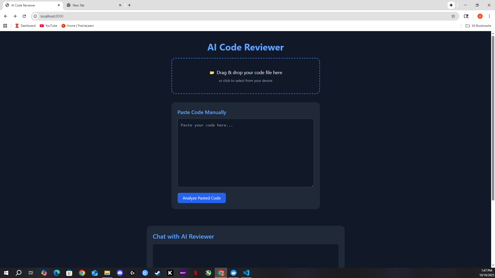
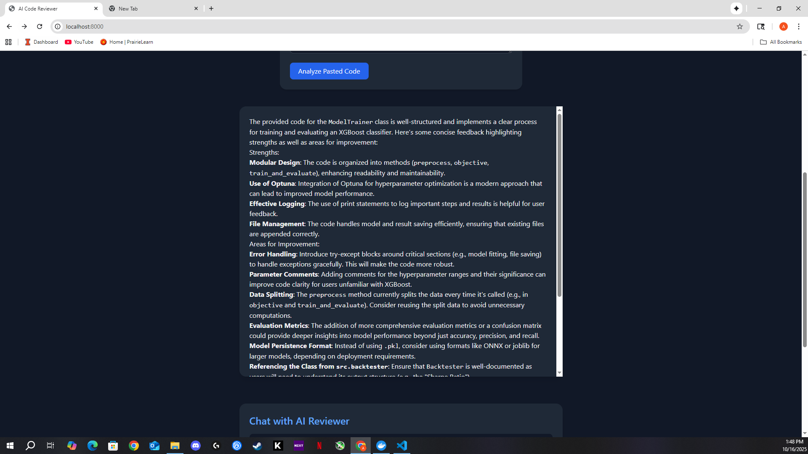
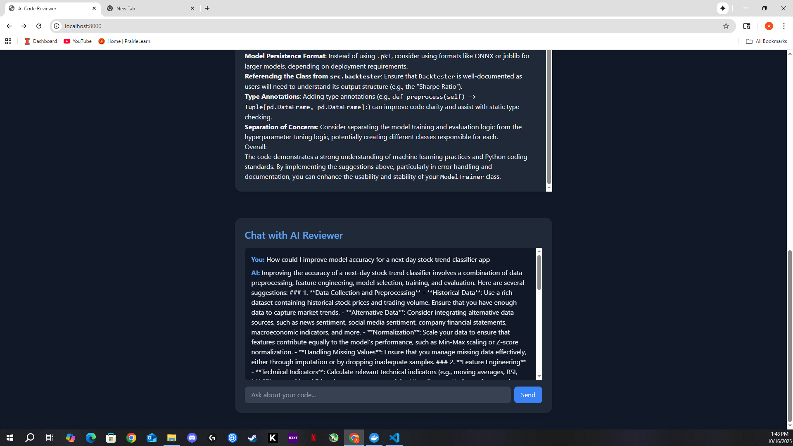

# AI Code Reviewer & Chat Assistant

A full-stack web app that performs **AI-powered code reviews** with inline feedback, readability analysis, and natural-language explanations.  
Built with **FastAPI**, **JavaScript**, and **OpenAI’s GPT-4o-mini**, it lets users drag-and-drop files or paste code into an editor, receive instant AI review comments, and chat with an integrated assistant for deeper clarification.

  
  
  

---

# Features

- **Automatic Code Review** – Analyzes syntax, structure, and complexity using Python’s AST parsing and GPT-4o-mini for semantic feedback.  
- **Chat Assistant** – Built-in chatbot for follow-up questions (“why is this bad?”, “how can I optimize this?”).  
- **Modern UI** – Responsive frontend built with TailwindCSS and syntax highlighting for multiple languages.  
- **Backend Integration** – FastAPI service orchestrating GPT model calls and AST-based static analysis.  
- **Containerized** – Fully packaged with Docker for reproducible builds and one-command deployment.  
- **API-Driven Architecture** – Clear separation between frontend, backend, and AI orchestration layer.

---

# Tech Stack

**Frontend:** JavaScript, TailwindCSS, Markdown Rendering, Syntax Highlighting  
**Backend:** Python, FastAPI, OpenAI API, AST Analysis  
**Infrastructure:** Docker, REST APIs  
**Model:** GPT-4o-mini (for code feedback and natural-language summaries)

---

# Demo

---

# How It Works

1. **User Uploads Code:** Drag-and-drop or paste code into the editor.  
2. **Static Analysis:** The backend parses the file using Python’s `ast` module to flag structural or complexity issues.  
3. **AI Review:** GPT-4o-mini processes both the AST summary and code text to generate detailed feedback.  
4. **Interactive Chat:** The user can ask clarifying questions about the feedback.  
5. **Dockerized Deployment:** The entire stack runs via Docker Compose for easy setup.

---

## Setup & Run Locally

# Clone the repo
git clone https://github.com/ashanksagar/AI-Code-Reviewer.git
cd AI-Code-Reviewer

# Set your OpenAI API key
export OPENAI_API_KEY="your_api_key_here"

# Then start the backend
uvicorn app:app --host 0.0.0.0 --port 8000

